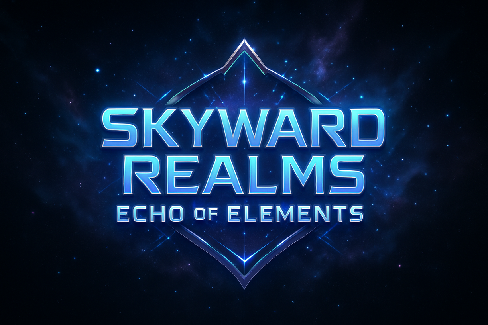

# 🏰 Skyward Realms Game

A modern 3D fantasy RPG game built with React, Babylon.js, and cutting-edge web technologies. Features beautiful procedural worlds with optional custom asset replacement and advanced physics systems.



## ✨ Features

### 🎮 Core Game Features
- **3D World Rendering**: Immersive 3D environment with Babylon.js physics
- **Character Selection**: Choose from 4 elemental characters (Fire, Water, Earth, Air)
- **Procedural Characters**: Beautiful fallback characters with elemental effects
- **Physics System**: Cannon.js integration with collision detection
- **Camera Controls**: Mouse lock/unlock with ESC key, full vertical look
- **Elemental Effects**: Fire, water, earth, and air visual effects
- **Procedural World**: Dynamic terrain, vegetation, and skybox generation

### 🎨 Visual Features
- **Magical UI**: Animated backgrounds with floating particles
- **Arabic/English Support**: Bilingual interface
- **Responsive Design**: Works on desktop and mobile
- **Procedural Skybox**: Beautiful gradient sky when no environment textures
- **Particle Systems**: Elemental character effects and atmospheric particles

### 🎲 Procedural Game Systems
- **Procedural Characters**: Beautiful elemental characters with physics and effects
- **Dynamic Quests**: Auto-generated quests based on player level and progress
- **Skill System**: Elemental abilities with procedural effects and progression
- **Resource System**: Gathering, crafting, and item management with meaningful rewards
- **Story Progress**: Dynamic narrative that adapts to player actions
- **Level Progression**: Stat growth, experience gain, and character advancement

### 🛠️ Technical Features
- **100% Babylon.js**: Completely optimized for Babylon.js engine
- **Modern React**: Built with React 19 and functional components
- **Advanced Physics**: Cannon.js integration with collision detection
- **Procedural Systems**: Beautiful fallback systems for all game features
- **Asset System**: Custom asset support with graceful procedural defaults
- **Error Handling**: Robust fallbacks ensure game always works
- **Performance Optimized**: Clean architecture with no unused dependencies

## 🚀 Quick Start

### Prerequisites
- **Node.js** (v18 or higher)
- **npm** or **pnpm** (recommended)
- Modern web browser with WebGL support

### Installation

1. **Clone the repository**
   ```bash
   git clone https://github.com/proxy0knight/Skyward-Realms-Game.git
   cd Skyward-Realms-Game
   ```

2. **Navigate to game directory**
   ```bash
   cd game-client
   ```

3. **Install dependencies**
   ```bash
   # Using npm
   npm install

   # Using pnpm (recommended - faster)
   pnpm install

   # Using yarn
   yarn install
   ```

4. **Start the development server**
   ```bash
   # Using npm
   npm run dev

   # Using pnpm
   pnpm run dev

   # Using yarn
   yarn dev
   ```

5. **Open your browser**
   - Navigate to `http://localhost:5173`
   - The game will load automatically with beautiful procedural defaults

## 📦 Dependencies Overview

### Core Dependencies
- **@babylonjs/core**: 3D rendering engine
- **@babylonjs/loaders**: GLB/GLTF model loading
- **@babylonjs/materials**: Advanced materials and shaders
- **cannon**: Physics engine for collisions
- **react**: Frontend framework (v19)
- **react-dom**: React DOM rendering

### UI Dependencies
- **@radix-ui/***: Professional UI components
- **tailwindcss**: Utility-first CSS framework
- **lucide-react**: Beautiful icon library
- **framer-motion**: Smooth animations
- **class-variance-authority**: Component variants

### Development Dependencies
- **vite**: Fast build tool and dev server
- **eslint**: Code linting
- **@vitejs/plugin-react**: React integration

## 🎯 How to Play

### Main Menu
- **ابدأ المغامرة (Start Adventure)**: Begin your journey
- **لوحة التحكم (Admin Panel)**: Access admin features

### Character Selection
Choose your elemental character:
- 🔥 **Fire Elemental**: Bright orange/red with fire particles
- 💧 **Water Elemental**: Blue/cyan with water effects  
- 🏔️ **Earth Elemental**: Green/brown with earth particles
- 💨 **Air Elemental**: Light blue/white with wind effects

### In-Game Controls
- **WASD** or **Arrow Keys**: Move character
- **Mouse**: Look around (click to lock/unlock cursor)
- **ESC**: Unlock mouse cursor
- **Space**: Jump (with cooldown)
- **Movement**: Smooth physics-based movement with collision detection

## 🎨 Asset Management & Placeholders

The game features a flexible asset system with beautiful procedural defaults and optional custom asset replacement.

### 📁 Asset Directory Structure

```
game-client/public/
├── assets/
│   ├── models/
│   │   ├── characters/         # Custom character GLB models
│   │   │   ├── [ADD] fire.glb
│   │   │   ├── [ADD] water.glb  
│   │   │   ├── [ADD] earth.glb
│   │   │   └── [ADD] air.glb
│   │   ├── props/             # Environment props/objects
│   │   └── weapons/           # Weapon models
│   ├── images/
│   │   └── game-logo.png      # Game logo (can be replaced)
│   └── audio/                 # Sound effects and music
├── textures/                  # Environment maps and textures
│   ├── [ADD] environment.env  # Babylon.js environment
│   ├── [ADD] environment.hdr  # HDR environment
│   └── [ADD] skybox.env       # Alternative environment
└── particles/                 # Particle effect textures
    └── [ADD] *.png files
```

### 🎭 Character Models (Optional Replacements)

**Location:** `/public/assets/models/characters/`

Add GLB files to replace procedural characters:

**Fire Element:**
- `fire.glb` (primary)
- `fire_character.glb` (alternative)

**Water Element:**
- `water.glb` (primary)  
- `water_character.glb` (alternative)

**Earth Element:**
- `earth.glb` (primary)
- `earth_character.glb` (alternative)

**Air Element:**
- `air.glb` (primary)
- `wind.glb` (alternative)
- `air_character.glb` (alternative)

#### Character Model Requirements:
- **Format:** `.glb` (preferred) or `.gltf`
- **Scale:** Roughly 2 units tall
- **Origin:** Centered at (0,0,0)
- **Animations:** Optional (idle, walk, run, jump)

#### Fallback Behavior:
If no GLB model is found, beautiful **procedural characters** are created with:
- Elemental colors and materials
- Particle effects matching element type
- Full physics and collision detection
- Professional appearance

### 🌍 Environment Maps (Optional)

**Location:** `/public/textures/`

Add environment files for realistic lighting:

1. `environment.env` (Babylon.js format - preferred)
2. `environment.hdr` (HDR format)  
3. `skybox.env` (alternative name)
4. `world.env` (alternative name)

#### Environment Requirements:
- **Formats:** `.env` (Babylon.js), `.hdr`, `.exr`
- **Resolution:** 1024x512 or higher
- **Content:** 360° panoramic environment

#### Fallback Behavior:
Without environment files, a **beautiful procedural sky** is created with:
- Gradient blue atmosphere
- Proper lighting simulation
- Clean, professional look

### 🖼️ Other Replaceable Assets

**Game Logo:**
- Replace `/public/assets/images/game-logo.png` with your custom logo
- **Recommended:** 256x256 PNG with transparency

**Audio Files (Future):**
```
public/assets/audio/
├── music/
│   ├── [ADD] background.mp3
│   ├── [ADD] combat.mp3  
│   └── [ADD] ambient.mp3
├── sfx/
│   ├── [ADD] jump.wav
│   ├── [ADD] footsteps.wav
│   └── elemental/
│       ├── [ADD] fire_cast.wav
│       ├── [ADD] water_splash.wav
│       ├── [ADD] earth_rumble.wav
│       └── [ADD] wind_whoosh.wav
```

## 🛠️ Development

### Available Scripts
```bash
# Development
npm run dev          # Start development server with hot reload
npm run build        # Build optimized production version
npm run preview      # Preview production build locally

# Code Quality  
npm run lint         # Check code for issues
```

### Project Structure
```
Skyward-Realms-Game/
├── game-client/              # Main React application
│   ├── src/
│   │   ├── components/       # React components
│   │   │   ├── ui/          # Reusable UI components  
│   │   │   ├── MainMenu.jsx # Main menu component
│   │   │   ├── GameScene.jsx# 3D game scene
│   │   │   └── ...          # Other components
│   │   ├── lib/             # Game systems
│   │   │   ├── BabylonGameEngine.js  # Main game engine
│   │   │   ├── BabylonCharacter.js   # Character system
│   │   │   └── ...          # Other systems
│   │   └── main.jsx         # Application entry point
│   ├── public/              # Static assets
│   │   ├── assets/          # Game assets (models, images, audio)
│   │   └── textures/        # Environment textures
│   ├── package.json         # Dependencies and scripts
│   └── vite.config.js       # Build configuration
├── README.md                # This file
└── .gitignore              # Git ignore patterns
```

### Key Technologies
- **Frontend**: React 19, Vite, Tailwind CSS
- **3D Engine**: Babylon.js (100% optimized architecture)
- **3D Graphics**: GLB/GLTF loading, procedural generation
- **Physics**: Cannon.js physics engine with collision detection
- **Game Systems**: Procedural fallbacks for skills, quests, crafting
- **Build Tool**: Vite (fast HMR and building)
- **Package Manager**: pnpm (faster than npm)

## 🔧 Troubleshooting

### Common Issues

**Models Not Loading?**
1. Check file is in `/public/assets/models/characters/`
2. Verify filename matches expected names (fire.glb, water.glb, etc.)
3. Ensure GLB format is valid
4. Check browser console for error messages
5. **Fallback**: Beautiful procedural characters will appear automatically

**Environment Not Loading?**
1. Confirm file is in `/public/textures/`
2. Try different formats (.env, .hdr)
3. Check file size isn't too large (>50MB)
4. **Fallback**: Procedural sky will be used automatically

**Physics Errors?**
1. Restart development server: `npm run dev`
2. Clear browser cache (Ctrl+F5)
3. Check browser console for detailed errors
4. **Fallback**: Movement fallback prevents crashes

**Performance Issues?**
1. Close other browser tabs
2. Update graphics drivers
3. Try different browser (Chrome recommended)
4. Reduce asset file sizes

### Getting Help
- Check browser console (F12) for error messages
- Ensure all dependencies are installed: `npm install`
- Try deleting `node_modules` and reinstalling
- The game uses graceful fallbacks - it should always work!

## 🎨 Asset Sources (Free Resources)

### 3D Models
- **Sketchfab**: Free downloadable models
- **Poly Haven**: Free 3D assets
- **Blender**: Create custom models
- **Mixamo**: Character animations

### Environment Maps  
- **Poly Haven** (polyhaven.com): Free HDR environments
- **HDRI Haven**: High-quality skies
- **Blender**: Generate procedural environments

### Textures
- **Textures.com**: High-quality textures
- **Freepik**: Free texture packs
- **Unsplash**: Free photography

## 🤝 Contributing

1. Fork the repository
2. Create a feature branch (`git checkout -b feature/amazing-feature`)
3. Commit your changes (`git commit -m 'Add amazing feature'`)
4. Push to the branch (`git push origin feature/amazing-feature`)
5. Open a Pull Request

## 📝 License

This project is licensed under the MIT License - see the [LICENSE](LICENSE) file for details.

## 🙏 Acknowledgments

- **Babylon.js**: Powerful 3D engine
- **React**: Modern UI framework  
- **Tailwind CSS**: Utility-first styling
- **Cannon.js**: Physics simulation
- **Lucide React**: Beautiful icons
- **Vite**: Lightning-fast build tool

## 📞 Support

If you encounter any issues:
1. Check the [Issues](https://github.com/proxy0knight/Skyward-Realms-Game/issues) page
2. Create a new issue with:
   - System information (OS, browser, Node.js version)
   - Error messages from browser console
   - Steps to reproduce the problem
3. The game uses fallback systems - it should work even with missing assets!

---

**🎮 Ready to play? Run `cd game-client && npm install && npm run dev` and start your adventure!**

**Made with ❤️ for the gaming community**

